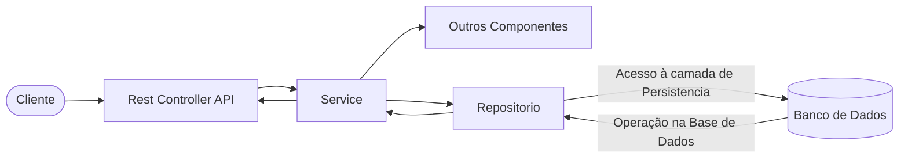

---

# Spring Configuration, Beans & Dependency Injection

A practical guide using a car factory example.

---

## The Problem

Imagine your application needs a `Motor`. Without Spring, every class that needs it must create its own:

```java
public class FactoryController {
    private Motor motor = new Motor("1.5 Turbo", 173, 4, 1.5, TipoMotor.TURBO); // tightly coupled
}
```

This is bad: hard to test, hard to change, duplicated everywhere.

Spring solves this with the **Application Context** — a container that creates, manages, and shares objects (beans) across your entire application.

---

## Step 1 — Define your domain

```java
public enum TipoMotor {
    ASPIRADO, TURBO, HIBRIDO
}

public enum Montadora {
    Honda, Toyota, Ford, Chevrolet, Volkswagen
}

public record Motor(String modelo, int cavalos, int cilindros, double litragem, TipoMotor tipoMotor) {

    @Override
    public String toString() {
        return "Motor{modelo='%s', cavalos=%d, cilindros=%d, litragem=%.1fL, tipo=%s}"
                .formatted(modelo, cavalos, cilindros, litragem, tipoMotor);
    }
}
```

Plain Java — no Spring annotations yet. This is intentional: domain objects should not depend on the framework.

---

## Step 2 — `@Configuration` and `@Bean`

```java
@Configuration
public class MontadoraConfiguration {

    @Bean
    public Motor motor() {
        return new Motor("1.5 Turbo", 173, 4, 1.5, TipoMotor.TURBO);
    }
}
```

- **`@Configuration`** — marks this class as a source of bean definitions. Spring reads it at startup.
- **`@Bean`** — tells Spring: *"call this method once, store the result, and make it available to anyone who needs a `Motor`"*.

The returned object lives in the **Application Context** as a singleton — one shared instance for the entire application.

---

## Step 3 — Bean Names and `@Qualifier`

When you have **multiple beans of the same type**, Spring doesn't know which one to inject. This is exactly our case — three different motors:

```java
@Configuration
public class MontadoraConfiguration {

    @Bean
    public Motor motorEletrico() {                          // bean name = "motorEletrico"
        return new Motor("1.5 Turbo", 173, 4, 1.5, TipoMotor.TURBO);
    }

    @Bean(name = "motorHibrido")                           // explicit custom name
    public Motor motorHibrido() {
        return new Motor("2.0 Híbrido", 200, 4, 2.0, TipoMotor.HIBRIDO);
    }

    @Bean(name = "motorAspirado")                          // explicit custom name
    public Motor motorAspirado() {
        return new Motor("2.0 Aspirado", 150, 4, 2.0, TipoMotor.ASPIRADO);
    }
}
```

**Bean name rules:**
- By default, the bean name = the method name (`motorEletrico`)
- You can override it with `@Bean(name = "customName")`

If you try to inject `Motor` without specifying which one, Spring throws `NoUniqueBeanDefinitionException`.

---

## Step 4 — Dependency Injection with `@Autowired` + `@Qualifier`

Use `@Qualifier` to tell Spring exactly which bean to inject:

```java
@RestController
public class FactoryController {

    @Autowired
    @Qualifier("motorHibrido") // picks the bean named "motorHibrido"
    private Motor motor;

    @PostMapping("/ligar")
    public CarroStatus ligar(@RequestBody Chave chave) {
        var carro = new HondaHRV(motor);
        return carro.darIgnicao(chave);
    }
}
```

Without `@Qualifier`, Spring resolves by type — fine when there's one bean. With multiple beans of the same type, `@Qualifier` is required.

| Scenario | Result |
|---|---|
| 1 bean of type `Motor` | `@Autowired` alone works |
| 2+ beans of type `Motor`, no `@Qualifier` | `NoUniqueBeanDefinitionException` |
| 2+ beans of type `Motor` + `@Qualifier("name")` | Spring injects the named bean |

Spring looks into the Application Context, finds the `motorHibrido` bean registered by `MontadoraConfiguration`, and injects it into `FactoryController`.

---

## Step 5 — Using the injected bean

`Carro` receives the `Motor` via its constructor (the only required field):

```java
public class Carro {
    private String modelo;
    private Color cor;
    private Motor motor;      // injected by the controller
    private Montadora montadora;

    public Carro(Motor motor) {
        this.motor = motor;
    }

    public CarroStatus darIgnicao(Chave chave) {
        if (chave.montadora() == this.montadora) {
            return new CarroStatus(true, "Carro ligado! " + motor);
        }
        return new CarroStatus(false, "Chave incompatível.");
    }
}
```

`HondaHRV` extends `Carro` and fills in the remaining fields:

```java
public class HondaHRV extends Carro {

    public HondaHRV(Motor motor) {
        super(motor);
        setModelo("HRV");
        setCor(Color.BLACK);
        setMontadora(Montadora.Honda);
    }
}
```

---

## Step 6 — The API

```java
public record Chave(Montadora montadora, String tipo) {}
public record CarroStatus(boolean sucesso, String mensagem) {}
```

```http
POST http://localhost:8080/ligar
Content-Type: application/json

{
  "montadora": "Honda",
  "tipo": "original"
}
```

Response:
```json
{
  "sucesso": true,
  "mensagem": "Carro ligado! Motor{modelo='1.5 Turbo', cavalos=173, cilindros=4, litragem=1.5L, tipo=TURBO}"
}
```

---

## How it all fits together

```
@Configuration (MontadoraConfiguration)
    ├── @Bean motorEletrico()  → registered as "motorEletrico"
    ├── @Bean motorHibrido()   → registered as "motorHibrido"
    └── @Bean motorAspirado()  → registered as "motorAspirado"

Application Context
    └── holds 3 Motor singletons by name

@RestController (FactoryController)
    └── @Autowired + @Qualifier("motorHibrido") → Spring injects motorHibrido
        └── new HondaHRV(motor) → HondaHRV uses the injected Motor
            └── darIgnicao(chave) → returns CarroStatus
```

---

## Key rules

| Concept | Rule |
|---|---|
| `@Configuration` | One per logical group of beans |
| `@Bean` | One instance created, shared everywhere (singleton by default) |
| `@Autowired` | Spring resolves by type — one `Motor` bean = unambiguous injection |
| `@Bean(name=)` | Override default bean name (default = method name) |
| `@Qualifier` | Required when multiple beans of the same type exist |
| Custom qualifier | Preferred over `@Qualifier` string — type-safe and refactor-friendly |
| Domain objects | Keep them free of Spring annotations |
| Constructor injection | Preferred over field injection — easier to test |

---

## Custom Qualifier Annotations

`@Qualifier("motorAspirado")` works but has a problem: the string can be mistyped and the compiler won't catch it.

The solution is a **custom qualifier annotation**:

```java
@Retention(RetentionPolicy.RUNTIME)  // Spring reads it at runtime
@Target({ElementType.FIELD,          // can be placed on fields
         ElementType.PARAMETER,      // on method parameters
         ElementType.METHOD})        // on @Bean methods
public @interface Aspirado {}
```

Apply it on both sides — the `@Bean` definition and the injection point:

```java
// MontadoraConfiguration.java
@Bean
@Aspirado
public Motor motorAspirado() {
    return new Motor("2.0 Aspirado", 150, 4, 2.0, TipoMotor.ASPIRADO);
}
```

```java
// FactoryController.java
@Autowired
@Aspirado               // Spring matches this to the @Bean also annotated with @Aspirado
private Motor motor;
```

Spring sees `@Aspirado` on the field and finds the `@Bean` also marked `@Aspirado` — no strings involved.

### `@Qualifier` vs custom annotation

| | `@Qualifier("motorAspirado")` | `@Aspirado` |
|---|---|---|
| Typo risk | Yes — string can be wrong | No — compile-time safe |
| Refactor support | Manual string search | IDE renames everywhere |
| Readability | Generic | Domain-specific |

**Custom qualifiers are the preferred approach** for production code whenever you have multiple beans of the same type.

---

## Dependency Injection — How It Works

**Dependency Injection (DI)** is a design pattern where an object receives its dependencies from the outside instead of creating them itself.

### Without DI (tight coupling)

```java
public class CarService {
    private MotorRepository motorRepository = new MotorRepository(); // creates its own dependency
    private EmailService emailService = new EmailService();          // and another one
}
```

Problems:
- `CarService` controls the lifecycle of its dependencies
- Impossible to swap implementations (e.g. for testing)
- Constructor signature hides what the class actually needs

### With DI (loose coupling)

```java
public class CarService {
    private final MotorRepository motorRepository;
    private final EmailService emailService;

    public CarService(MotorRepository motorRepository, EmailService emailService) {
        this.motorRepository = motorRepository;  // received, not created
        this.emailService = emailService;
    }
}
```

Now `CarService` declares what it needs. The caller (or a DI container) decides what to provide.

### How Spring does it

Spring acts as the **DI container**: it creates all beans, resolves their dependencies, and wires everything together automatically.

```java
@Service
public class CarService {
    private final MotorRepository motorRepository;
    private final EmailService emailService;

    // Spring sees one constructor → injects automatically (no @Autowired needed)
    public CarService(MotorRepository motorRepository, EmailService emailService) {
        this.motorRepository = motorRepository;
        this.emailService = emailService;
    }
}
```

Spring reads `@Service`, creates a `CarService` bean, looks up `MotorRepository` and `EmailService` beans in the Application Context, and passes them in. You never call `new CarService(...)` yourself.

### Three injection styles

| Style | Example | When to use |
|---|---|---|
| **Constructor injection** | `CarService(MotorRepository r)` | Preferred — immutable, testable |
| **Field injection** | `@Autowired private MotorRepository r` | Convenient but hides deps, hard to test |
| **Setter injection** | `@Autowired void setRepo(MotorRepository r)` | Optional dependencies only |

Constructor injection is the recommended approach. Spring 4.3+ auto-injects when there is a single constructor.

---

## Bean Scopes

Every bean in Spring has a **scope** that controls how many instances exist and for how long.

> **Default scope for any bean is `singleton`.**

You set a scope with `@Scope`:

```java
@Bean
@Scope("prototype")
public Motor motor() {
    return new Motor("1.5 Turbo", 173, 4, 1.5, TipoMotor.TURBO);
}

// or using the constant (preferred — no magic strings)
@Bean
@Scope(ConfigurableBeanFactory.SCOPE_PROTOTYPE)
public Motor motor() { ... }
```

### Core scopes

| Scope | Annotation / value | Instances | Lifetime | Typical use |
|---|---|---|---|---|
| **Singleton** | `@Scope("singleton")` or omit | **1 per container** | Application lifetime | Services, repositories, controllers — stateless shared objects |
| **Prototype** | `@Scope("prototype")` | **New instance per injection** | Until GC | Stateful objects that must not be shared (e.g. command objects) |

### Web-only scopes (require a web-aware ApplicationContext)

| Scope | Value | Instances | Lifetime |
|---|---|---|---|
| **Request** | `@RequestScope` / `"request"` | 1 per HTTP request | Discarded after response |
| **Session** | `@SessionScope` / `"session"` | 1 per HTTP session | Discarded when session expires |
| **Application** | `@ApplicationScope` / `"application"` | 1 per ServletContext | Same as singleton but bound to ServletContext |

```java
@Component
@RequestScope          // fresh instance for every incoming HTTP request
public class CartContext {
    private List<Item> items = new ArrayList<>();
    // safe to store per-request state here
}
```

### Singleton vs Prototype — practical difference

```java
// Singleton: Spring returns the SAME instance every time
@Bean
public MotorService motorService() { return new MotorService(); }

// Somewhere in the app:
MotorService a = context.getBean(MotorService.class);
MotorService b = context.getBean(MotorService.class);
// a == b → true, same object

// Prototype: Spring creates a NEW instance every time
@Bean
@Scope("prototype")
public MotorBuilder motorBuilder() { return new MotorBuilder(); }

MotorBuilder x = context.getBean(MotorBuilder.class);
MotorBuilder y = context.getBean(MotorBuilder.class);
// x == y → false, different objects
```

### Key rules about scopes

- **Singleton beans are stateless by design** — they are shared across all threads and requests. Never store mutable per-request state in a singleton.
- **Prototype beans are not managed after creation** — Spring creates them but does not call `@PreDestroy` on prototype beans. Cleanup is your responsibility.
- **Injecting a prototype into a singleton breaks prototype semantics** — the singleton is created once and receives one prototype instance, which then acts like a singleton. To fix this, use `ApplicationContext.getBean()` or `ObjectProvider<T>` to look up a fresh prototype on each use.

```java
// Wrong: prototype injected into singleton → only one instance ever created
@Service
public class OrderService {
    @Autowired
    private PrototypeCart cart;  // always the same cart!
}

// Correct: use ObjectProvider to get a fresh instance each time
@Service
public class OrderService {
    @Autowired
    private ObjectProvider<PrototypeCart> cartProvider;

    public void processOrder() {
        PrototypeCart cart = cartProvider.getObject(); // new instance every call
    }
}
```

---

## Arquitetura Spring MVC


O **Container Spring** é o núcleo da aplicação. Ele inicializa o **Application Context**, que gerencia dois pilares:

- **Components** — os blocos funcionais da aplicação:
  - `Services` → lógica de negócio
  - `Repositories` → acesso a dados (SQL ou NoSQL)
  - `Controllers` → entrada da aplicação (API Rest ou Páginas Web)

- **Configurations** — o que configura o container:
  - `Beans` → objetos gerenciados pelo Spring (`@Bean`, `@Component`)
  - `application.yml / properties` → propriedades externas (porta, datasource, etc.)

### Fluxo de uma Requisição



- **Rest Controller** — recebe a requisição HTTP e delega para o `Service`
- **Service** — contém a lógica de negócio; orquestra repositórios e outros componentes
- **Repositorio** — acessa a camada de persistência (JPA, JDBC, etc.)
- **Banco de Dados** — executa a operação e retorna o resultado
