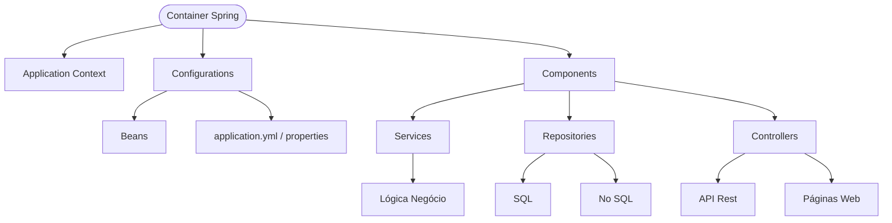

---

# Spring Configuration, Beans & Dependency Injection

A practical guide using a car factory example.

---

## The Problem

Imagine your application needs a `Motor`. Without Spring, every class that needs it must create its own:

```java
public class FactoryController {
    private Motor motor = new Motor("1.5 Turbo", 173, 4, 1.5, TipoMotor.TURBO); // tightly coupled
}
```

This is bad: hard to test, hard to change, duplicated everywhere.

Spring solves this with the **Application Context** — a container that creates, manages, and shares objects (beans) across your entire application.

---

## Step 1 — Define your domain

```java
public enum TipoMotor {
    ASPIRADO, TURBO, HIBRIDO
}

public enum Montadora {
    Honda, Toyota, Ford, Chevrolet, Volkswagen
}

public record Motor(String modelo, int cavalos, int cilindros, double litragem, TipoMotor tipoMotor) {

    @Override
    public String toString() {
        return "Motor{modelo='%s', cavalos=%d, cilindros=%d, litragem=%.1fL, tipo=%s}"
                .formatted(modelo, cavalos, cilindros, litragem, tipoMotor);
    }
}
```

Plain Java — no Spring annotations yet. This is intentional: domain objects should not depend on the framework.

---

## Step 2 — `@Configuration` and `@Bean`

```java
@Configuration
public class MontadoraConfiguration {

    @Bean
    public Motor motor() {
        return new Motor("1.5 Turbo", 173, 4, 1.5, TipoMotor.TURBO);
    }
}
```

- **`@Configuration`** — marks this class as a source of bean definitions. Spring reads it at startup.
- **`@Bean`** — tells Spring: *"call this method once, store the result, and make it available to anyone who needs a `Motor`"*.

The returned object lives in the **Application Context** as a singleton — one shared instance for the entire application.

---

## Step 3 — Dependency Injection with `@Autowired`

Now any class can receive the `Motor` without creating it:

```java
@RestController("factory")
public class FactoryController {

    @Autowired
    private Motor motor; // Spring finds the Motor bean and injects it here

    @PostMapping("/ligar")
    public CarroStatus ligar(@RequestBody Chave chave) {
        var carro = new Carro(motor);
        return carro.darIgnicao(chave);
    }
}
```

Spring looks into the Application Context, finds the `Motor` bean registered by `MontadoraConfiguration`, and injects it automatically.

---

## Step 4 — Using the injected bean

`Carro` receives the `Motor` via its constructor (the only required field):

```java
public class Carro {
    private String modelo;
    private Color cor;
    private Motor motor;      // injected by the controller
    private Montadora montadora;

    public Carro(Motor motor) {
        this.motor = motor;
    }

    public CarroStatus darIgnicao(Chave chave) {
        if (chave.montadora() == this.montadora) {
            return new CarroStatus(true, "Carro ligado! " + motor);
        }
        return new CarroStatus(false, "Chave incompatível.");
    }
}
```

`HondaHRV` extends `Carro` and fills in the remaining fields:

```java
public class HondaHRV extends Carro {

    public HondaHRV(Motor motor) {
        super(motor);
        setModelo("HRV");
        setCor(Color.BLACK);
        setMontadora(Montadora.Honda);
    }
}
```

---

## Step 5 — The API

```java
public record Chave(Montadora montadora, String tipo) {}
public record CarroStatus(boolean sucesso, String mensagem) {}
```

```http
POST http://localhost:8080/ligar
Content-Type: application/json

{
  "montadora": "Honda",
  "tipo": "original"
}
```

Response:
```json
{
  "sucesso": true,
  "mensagem": "Carro ligado! Motor{modelo='1.5 Turbo', cavalos=173, cilindros=4, litragem=1.5L, tipo=TURBO}"
}
```

---

## How it all fits together

```
@Configuration (MontadoraConfiguration)
    └── @Bean motor() → registers Motor in Application Context

Application Context
    └── holds Motor singleton

@RestController (FactoryController)
    └── @Autowired Motor → Spring injects the Motor bean
        └── new Carro(motor) → Carro uses the injected Motor
            └── darIgnicao(chave) → returns CarroStatus
```

---

## Key rules

| Concept | Rule |
|---|---|
| `@Configuration` | One per logical group of beans |
| `@Bean` | One instance created, shared everywhere (singleton by default) |
| `@Autowired` | Spring resolves by type — one `Motor` bean = unambiguous injection |
| Domain objects | Keep them free of Spring annotations |
| Constructor injection | Preferred over field injection — easier to test |
